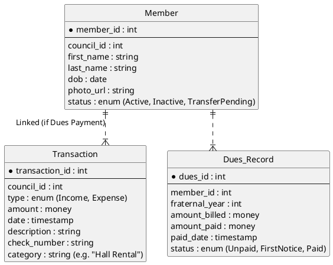

This is the final, comprehensive **Software Requirements Specification (SRS)** and **System Design Document (SDD)** for the "Officers Online" replacement.

This document integrates all your feedback, the specific Knights of Columbus transfer protocols, and the chosen **Flutter + gRPC** technology stack.

---

# Project Name: Officers Online (Next Gen)

**Client:** Knights of Columbus (Council Level)
**Tech Stack:** Flutter (Frontend), gRPC (Protocol), .NET Core (Backend)

## 1. Executive Summary

The system is a multi-platform administrative dashboard for local Council Officers (Grand Knights, Financial Secretaries) to manage membership, finances, and compliance. It replaces the legacy web portal with a modern, **offline-capable** application that supports **mobile use** and **digital data entry**.

## 2. User Roles & Permissions

* **Financial Secretary (FS):** Primary Administrator. Manages finances, membership roster, and transfers.
* **Grand Knight (GK):** Council Leader. Oversees reports, compliance, and officer assignments.
* **Delegate (New):** A standard member granted specific granular permissions (e.g., *Scribe*  "Send Email", *Treasurer*  "View Ledger").
* **District/State Officer:** Read-only access to multiple councils within their jurisdiction.

---

## 3. Functional Modules (Use Cases)

### 3.1 Membership Management & Intake

* **Candidate Intake (The "Pull" Transfer):**
* **Workflow:** The FS enters a new candidate's `First Name`, `Last Name`, and `DOB` into the Candidate Tab.
* **System Logic:** The system checks the Supreme Database.
* *If New:* Creates a new record.
* *If Existing:* System detects the member is active in another council. It flags this as a **Transfer**.


* **Action:** The FS enters the "Process Date" (Vote Date). The system automatically pulls the member's record to the new council and notifies the old council.


* **Prospect Management:**
* **Geospatial Assignment:** Online inquiries are auto-assigned to the nearest council based on Zip/Parish.
* **Conversion:** FS can "Promote" a prospect to a Candidate after they complete their exemplification.


* **Roster & Digital Cards:**
* **View:** List all members with filterable grid.
* **Photo Upload:** Ability to attach a profile photo to a member record.
* **Digital Membership Card:** A mobile-only view showing the member's standing and degree status (Offline accessible).


### 3.2 Financial Module (Full Ledger)

* **Member Billing (Dues):**
* **Assess Dues:** Batch process to apply annual dues (e.g., $30.00) to all "Billable" members.
* **Receive Payment:** FS manually marks a member as "Paid" (Cash/Check/Card). System generates a digital receipt.


* **Council Ledger (Accounting):**
* **Income Voucher:** Record all monies received (e.g., Pancake Breakfast proceeds, Donations).
* **Expense Voucher:** Record all checks written (e.g., Hall Rental, Utility Bill, Per Capita Tax).
* **Audit Report:** Auto-generate the "Semi-Annual Audit" PDF based on ledger entries.


### 3.3 Council Administration

* **Officer Management:**
* **Temporal Context:** Toggle between **"Current Fraternal Year"** and **"Next Fraternal Year"** to manage officer transitions (July 1st rollover).


* **Safe Environment:**
* **Dashboard:** Visual traffic-light system (Green/Red) showing which officers have completed their required background checks and training.


### 3.4 Communication

* **Bulk Email:** Filter recipients by degree, officer role, or dues status.
* **Schedule Send:** Users can draft an email and select a future date/time for delivery.

---

## 4. Technical Architecture

### 4.1 Technology Stack

* **Frontend:** **Flutter** (Dart).
* *Why:* Single codebase for iOS, Android, and Web. Strong typing matches the complex data models.
* *Key Libraries:* `isar` (Local Database), `grpc` (Network), `flutter_bloc` (State Management).


* **Protocol:** **gRPC** (Google Remote Procedure Call).
* *Why:* Smaller payload size than REST (critical for poor church Wi-Fi) and strict contract definition.


* **Backend:** **.NET 8** (C#).
* *Why:* Enterprise standard, integrates well with Microsoft-based reporting tools, excellent gRPC support.


### 4.2 Offline-First Architecture

To solve the connectivity issue, the app uses a **"Synchronization"** pattern.

1. **Online:** App pulls the latest `CouncilData` via gRPC and saves it to the local **Isar** database.
2. **Offline:** App reads from **Isar**. Users can "Mark Dues Paid" or "Add Candidate". These actions are queued in a local `MutationLog`.
3. **Re-connect:** When internet is restored, the `MutationLog` is replayed to the server via gRPC.

### 4.3 Database Schema (ERD)

Updated to include the full Financial Ledger.



---

## 5. gRPC Service Definitions (`.proto`)

These definitions serve as the strict contract between your Flutter app and the .NET Backend.

### 5.1 Membership Service

**File:** `protos/membership.proto`

```protobuf
syntax = "proto3";

package kofc.membership.v1;

import "google/protobuf/timestamp.proto";

service MembershipService {
  // Used for Transfers: System checks Name + DOB to find existing member
  rpc FindCandidate (FindCandidateRequest) returns (FindCandidateResponse);
  
  // Official Intake: Adds member or initiates transfer
  rpc ProcessCandidate (ProcessCandidateRequest) returns (CandidateResponse);
  
  // Get full roster for offline sync
  rpc GetCouncilRoster (RosterRequest) returns (stream MemberProfile);
}

message FindCandidateRequest {
  string first_name = 1;
  string last_name = 2;
  google.protobuf.Timestamp date_of_birth = 3;
}

message FindCandidateResponse {
  bool exists = 1;
  int32 existing_council_id = 2; // If set, this is a Transfer
  string member_number = 3;
}

message ProcessCandidateRequest {
  int32 target_council_id = 1;
  string first_name = 2;
  string last_name = 3;
  google.protobuf.Timestamp process_date = 4; // Date Voted In
  google.protobuf.Timestamp ceremonial_date = 5; // First Degree Date
}

```

### 5.2 Financial Service

**File:** `protos/finance.proto`

```protobuf
syntax = "proto3";

package kofc.finance.v1;

import "google/type/money.proto";
import "google/protobuf/timestamp.proto";

service FinanceService {
  // Record a ledger entry (Expense or Income)
  rpc RecordTransaction (TransactionRequest) returns (TransactionResponse);
  
  // Update a member's dues status (e.g. Mark Paid)
  rpc UpdateDuesStatus (DuesUpdateRequest) returns (DuesUpdateResponse);
}

message TransactionRequest {
  int32 council_id = 1;
  TransactionType type = 2; // INCOME or EXPENSE
  google.type.Money amount = 3;
  string description = 4;
  string check_number = 5; // Optional
  int32 linked_member_id = 6; // Optional (if Dues payment)
}

enum TransactionType {
  TRANSACTION_TYPE_UNSPECIFIED = 0;
  TRANSACTION_TYPE_INCOME = 1;
  TRANSACTION_TYPE_EXPENSE = 2;
}

```

---

## 6. Development Roadmap

1. **Phase 1: The Core (Flutter + gRPC Setup)**
* Set up the .NET Backend with Identity Server (Auth).
* Build the `GetCouncilRoster` gRPC endpoint.
* Build the Flutter "Digital Card" & Roster View (Read Only).

2. **Phase 2: Membership Operations**
* Implement "Find Candidate" logic (The Transfer "Pull").
* Implement Prospect List with Map integration.

3. **Phase 3: Financials**
* Build the "Mark Paid" toggle.
* Build the "Add Expense/Voucher" form.


4. **Phase 4: Comms & Offline**
* Implement "Schedule Send" (Backend Worker).
* Finalize `Isar` local database sync for offline mode.
