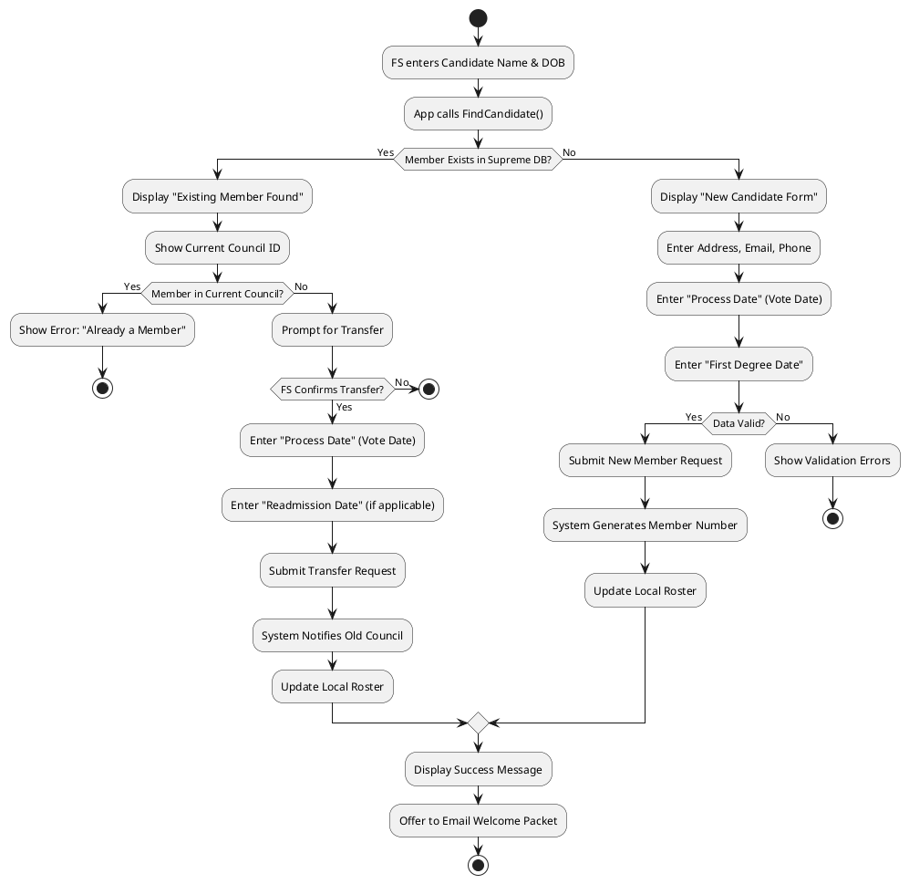
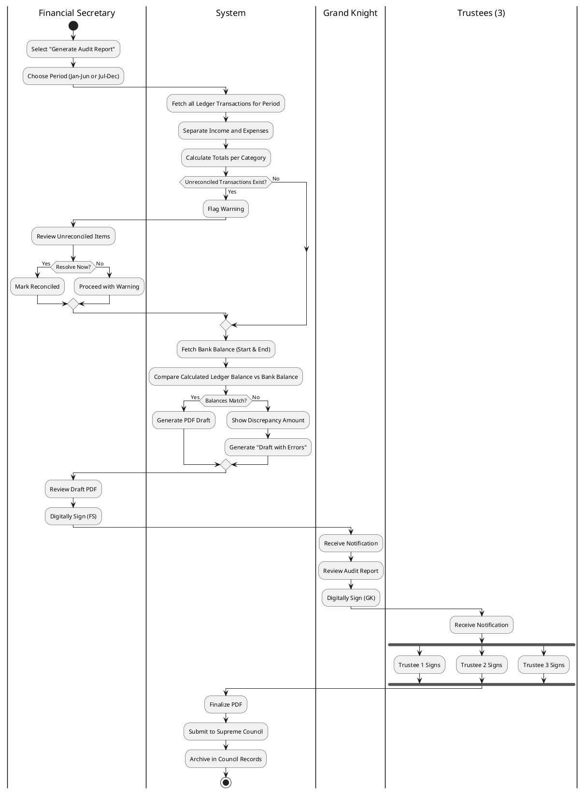

# Activity Diagrams

This document details the complex workflows and logic paths within the **Officers Online** application.

## 1. Candidate Intake Workflow

This diagram details the decision logic for processing a new candidate, differentiating between new members and transfers.

## 2. Semi-Annual Audit Workflow

The process of generating the required semi-annual financial audit report.

