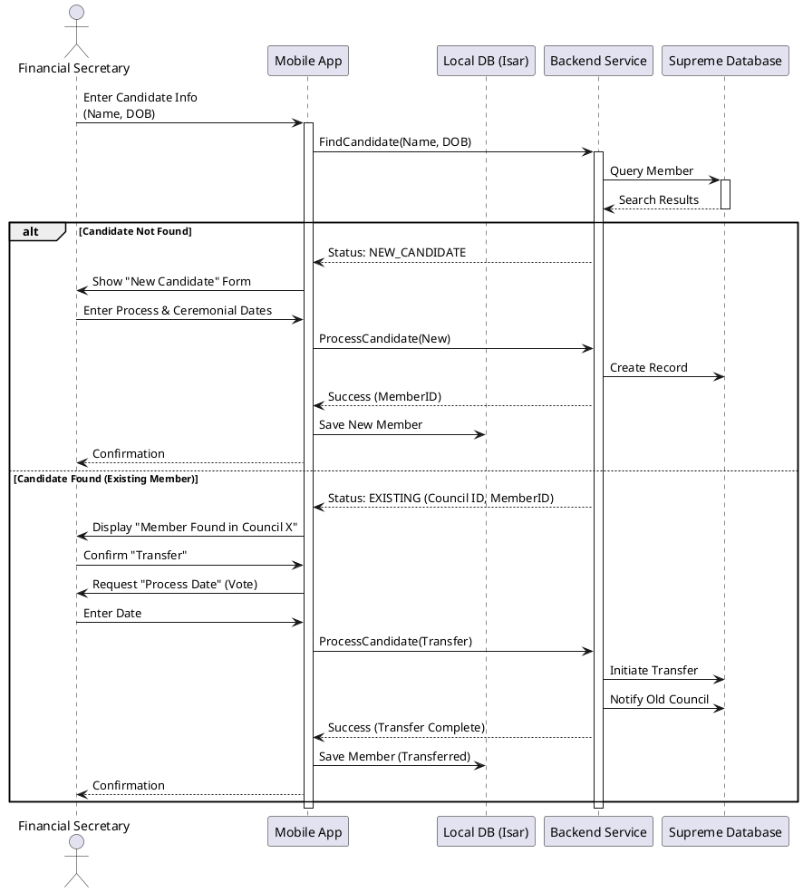
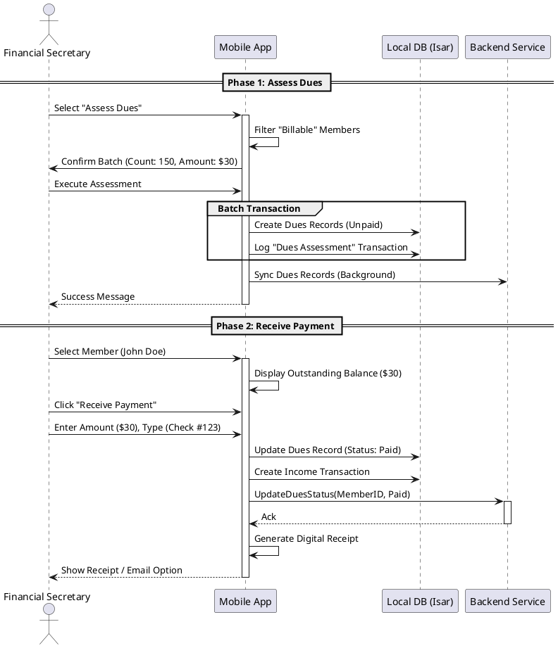
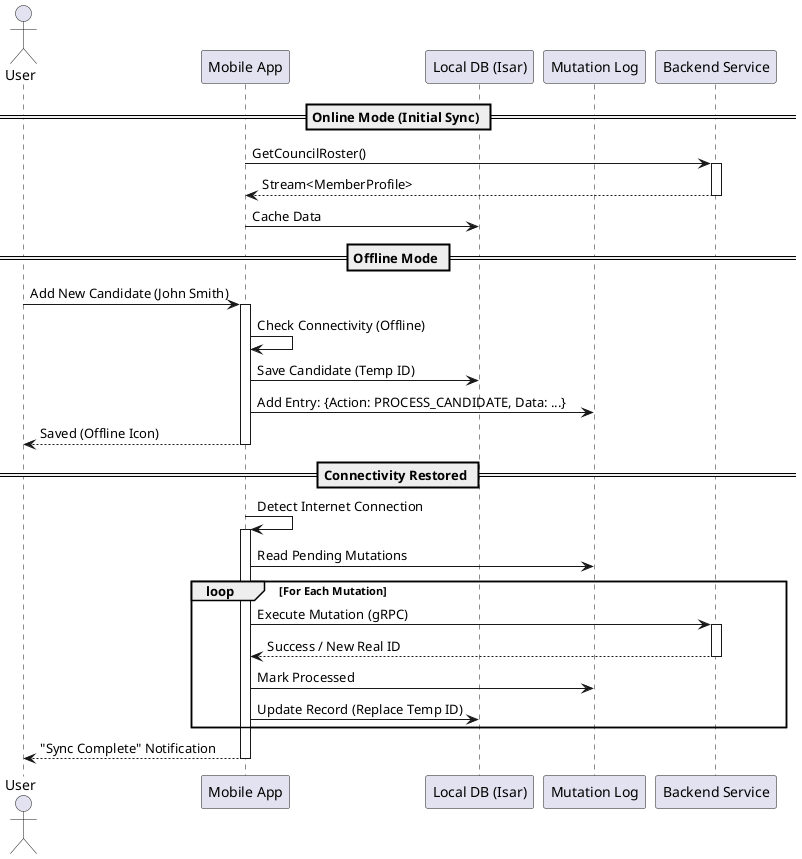

# Sequence Diagrams

This document details the interaction flows for key scenarios in the **Officers Online** application.

## 1. Candidate Intake & Transfer ("The Pull")

This scenario illustrates the workflow when the Financial Secretary enters a new candidate. The system checks the Supreme Database to determine if it is a new member or a transfer from another council.

## 2. Dues Assessment & Payment

This scenario shows the process of billing members for dues and subsequently receiving a payment.

## 3. Offline Synchronization

This illustrates the "Offline-First" architecture where actions taken while offline are queued and synced when connectivity is restored.

