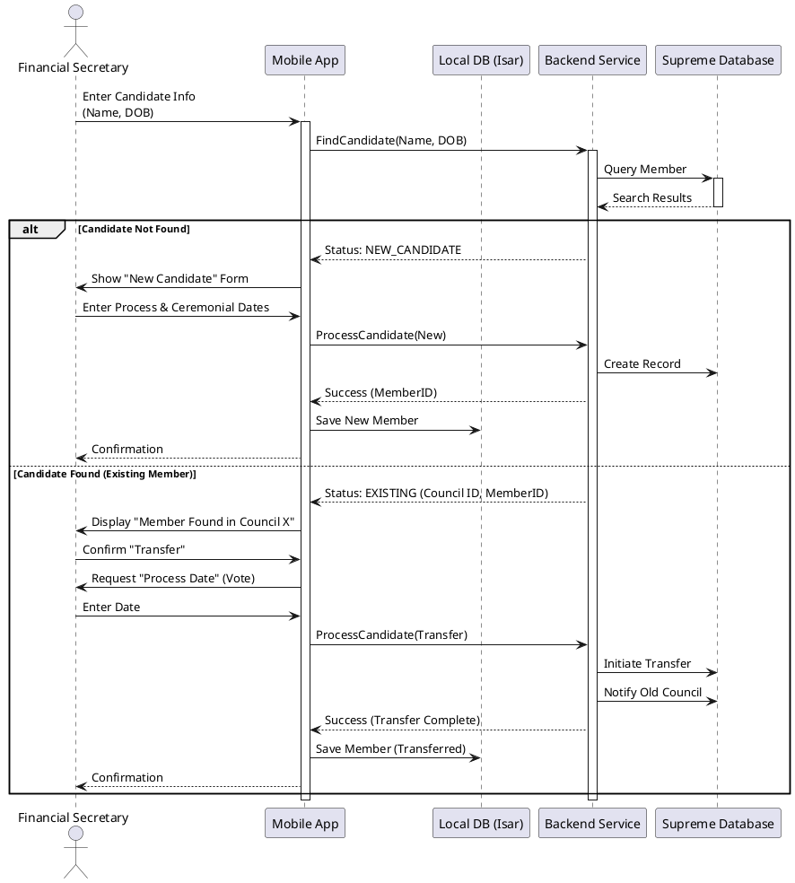
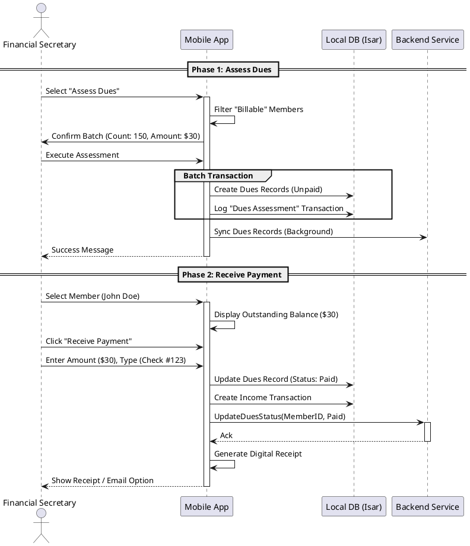
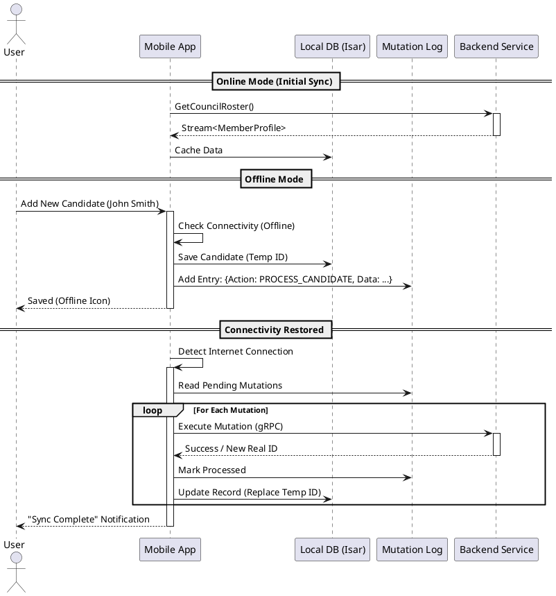
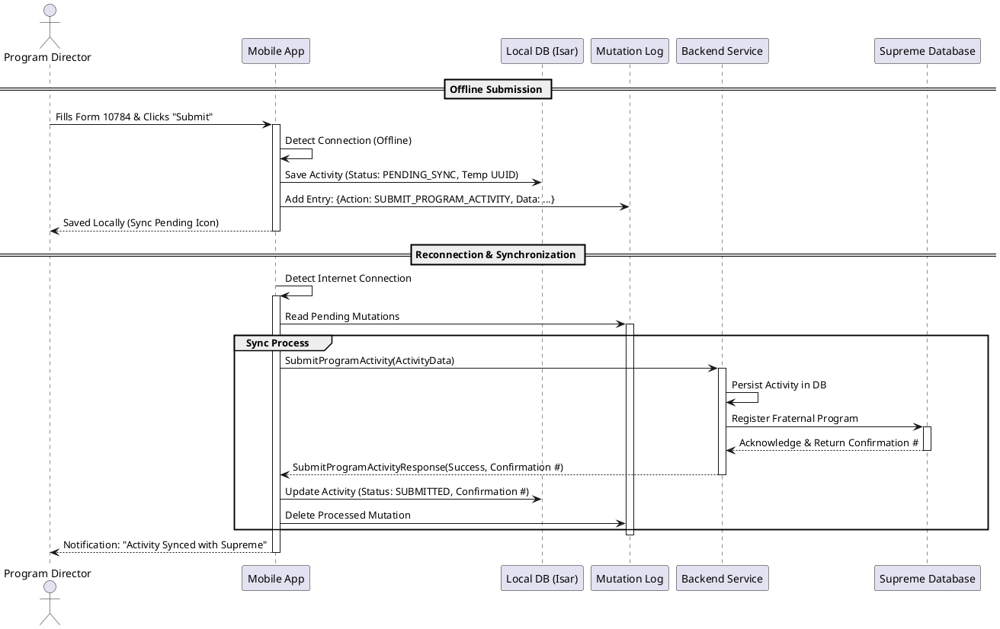
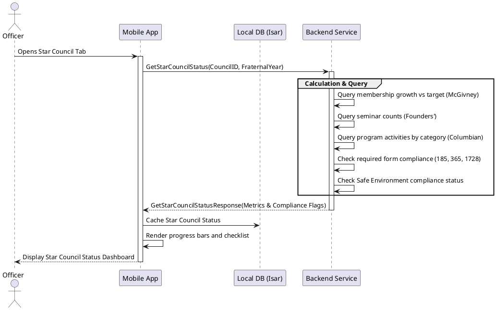

# Sequence Diagrams

This document details the interaction flows for key scenarios in the **Officers Online** application.

## 1. Candidate Intake & Transfer ("The Pull")

This scenario illustrates the workflow when the Financial Secretary enters a new candidate. The system checks the Supreme Database to determine if it is a new member or a transfer from another council.

```plantuml
@startuml
actor "Financial Secretary" as FS
participant "Mobile App" as App
participant "Local DB (Isar)" as LocalDB
participant "Backend Service" as Backend
participant "Supreme Database" as Supreme

FS -> App : Enter Candidate Info\n(Name, DOB)
activate App

App -> Backend : FindCandidate(Name, DOB)
activate Backend

Backend -> Supreme : Query Member
activate Supreme
Supreme --> Backend : Search Results
deactivate Supreme

alt Candidate Not Found
    Backend --> App : Status: NEW_CANDIDATE
    App -> FS : Show "New Candidate" Form
    FS -> App : Enter Process & Ceremonial Dates
    App -> Backend : ProcessCandidate(New)
    Backend -> Supreme : Create Record
    Backend --> App : Success (MemberID)
    App -> LocalDB : Save New Member
    App --> FS : Confirmation

else Candidate Found (Existing Member)
    Backend --> App : Status: EXISTING (Council ID, MemberID)
    App -> FS : Display "Member Found in Council X"
    FS -> App : Confirm "Transfer"
    App -> FS : Request "Process Date" (Vote)
    FS -> App : Enter Date
    App -> Backend : ProcessCandidate(Transfer)
    Backend -> Supreme : Initiate Transfer
    Backend -> Supreme : Notify Old Council
    Backend --> App : Success (Transfer Complete)
    App -> LocalDB : Save Member (Transferred)
    App --> FS : Confirmation
end

deactivate Backend
deactivate App
@enduml
```

## 2. Dues Assessment & Payment

This scenario shows the process of billing members for dues and subsequently receiving a payment.

```plantuml
@startuml
actor "Financial Secretary" as FS
participant "Mobile App" as App
participant "Local DB (Isar)" as LocalDB
participant "Backend Service" as Backend

== Phase 1: Assess Dues ==

FS -> App : Select "Assess Dues"
activate App
App -> App : Filter "Billable" Members
App -> FS : Confirm Batch (Count: 150, Amount: $30)
FS -> App : Execute Assessment

group Batch Transaction
    App -> LocalDB : Create Dues Records (Unpaid)
    App -> LocalDB : Log "Dues Assessment" Transaction
end

App -> Backend : Sync Dues Records (Background)
App --> FS : Success Message
deactivate App

== Phase 2: Receive Payment ==

FS -> App : Select Member (John Doe)
activate App
App -> App : Display Outstanding Balance ($30)
FS -> App : Click "Receive Payment"
FS -> App : Enter Amount ($30), Type (Check #123)
App -> LocalDB : Update Dues Record (Status: Paid)
App -> LocalDB : Create Income Transaction
App -> Backend : UpdateDuesStatus(MemberID, Paid)
activate Backend
Backend --> App : Ack
deactivate Backend

App -> App : Generate Digital Receipt
App --> FS : Show Receipt / Email Option
deactivate App
@enduml
```

## 3. Offline Synchronization

This illustrates the "Offline-First" architecture where actions taken while offline are queued and synced when connectivity is restored.

```plantuml
@startuml
actor User
participant "Mobile App" as App
participant "Local DB (Isar)" as LocalDB
participant "Mutation Log" as Log
participant "Backend Service" as Backend

== Online Mode (Initial Sync) ==
App -> Backend : GetCouncilRoster()
activate Backend
Backend --> App : Stream<MemberProfile>
deactivate Backend
App -> LocalDB : Cache Data

== Offline Mode ==
User -> App : Add New Candidate (John Smith)
activate App
App -> App : Check Connectivity (Offline)
App -> LocalDB : Save Candidate (Temp ID)
App -> Log : Add Entry: {Action: PROCESS_CANDIDATE, Data: ...}
App --> User : Saved (Offline Icon)
deactivate App

== Connectivity Restored ==
App -> App : Detect Internet Connection
activate App
App -> Log : Read Pending Mutations

loop For Each Mutation
    App -> Backend : Execute Mutation (gRPC)
    activate Backend
    Backend --> App : Success / New Real ID
    deactivate Backend
    App -> Log : Mark Processed
    App -> LocalDB : Update Record (Replace Temp ID)
end

App --> User : "Sync Complete" Notification
deactivate App
@enduml
```

## 4. Offline Form 10784 Submission & Sync

This diagram shows how a program activity submission is handled when the device is offline, queued locally, and synced once connectivity is restored.

```plantuml
@startuml
actor "Program Director" as User
participant "Mobile App" as App
participant "Local DB (Isar)" as LocalDB
participant "Mutation Log" as Log
participant "Backend Service" as Backend
participant "Supreme Database" as Supreme

== Offline Submission ==

User -> App : Fills Form 10784 & Clicks "Submit"
activate App
App -> App : Detect Connection (Offline)
App -> LocalDB : Save Activity (Status: PENDING_SYNC, Temp UUID)
App -> Log : Add Entry: {Action: SUBMIT_PROGRAM_ACTIVITY, Data: ...}
App --> User : Saved Locally (Sync Pending Icon)
deactivate App

== Reconnection & Synchronization ==

App -> App : Detect Internet Connection
activate App
App -> Log : Read Pending Mutations
activate Log

group Sync Process
    App -> Backend : SubmitProgramActivity(ActivityData)
    activate Backend
    Backend -> Backend : Persist Activity in DB
    Backend -> Supreme : Register Fraternal Program
    activate Supreme
    Supreme --> Backend : Acknowledge & Return Confirmation #
    deactivate Supreme
    Backend --> App : SubmitProgramActivityResponse(Success, Confirmation #)
    deactivate Backend
    App -> LocalDB : Update Activity (Status: SUBMITTED, Confirmation #)
    App -> Log : Delete Processed Mutation
end

deactivate Log
App --> User : Notification: "Activity Synced with Supreme"
deactivate App
@enduml
```

## 5. Star Council Tracker Dashboard Retrieval

This diagram describes the retrieval and calculation flow for the Star Council progress dashboard.

```plantuml
@startuml
actor Officer
participant "Mobile App" as App
participant "Local DB (Isar)" as LocalDB
participant "Backend Service" as Backend

Officer -> App : Opens Star Council Tab
activate App

App -> Backend : GetStarCouncilStatus(CouncilID, FraternalYear)
activate Backend

group Calculation & Query
    Backend -> Backend : Query membership growth vs target (McGivney)
    Backend -> Backend : Query seminar counts (Founders')
    Backend -> Backend : Query program activities by category (Columbian)
    Backend -> Backend : Check required form compliance (185, 365, 1728)
    Backend -> Backend : Check Safe Environment compliance status
end

Backend --> App : GetStarCouncilStatusResponse(Metrics & Compliance Flags)
deactivate Backend

App -> LocalDB : Cache Star Council Status
App -> App : Render progress bars and checklist
App --> Officer : Display Star Council Status Dashboard
deactivate App
@enduml
```

