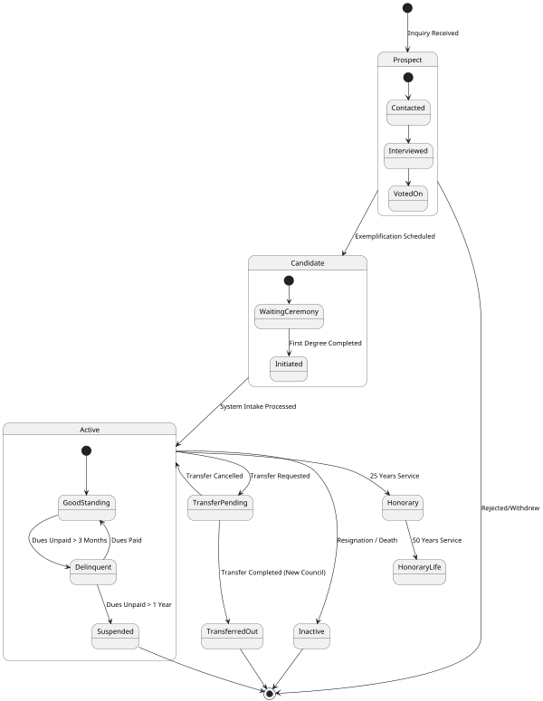
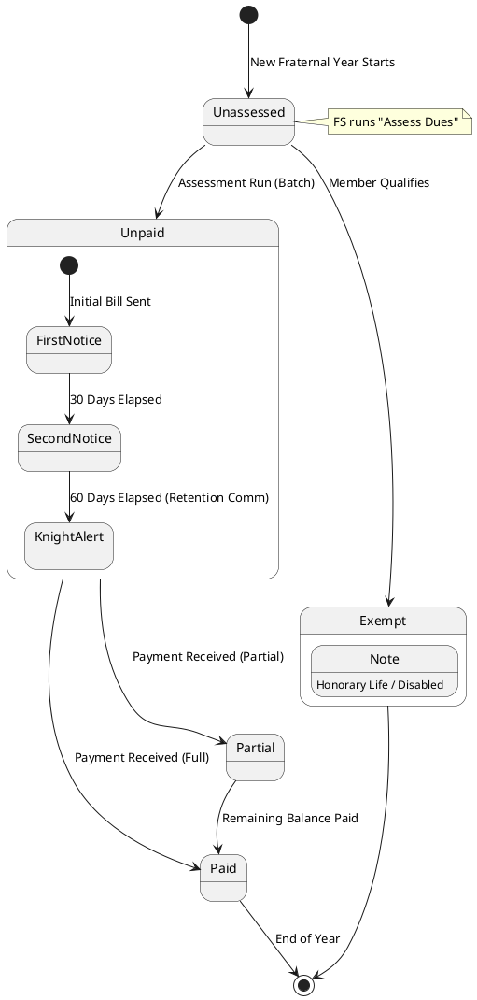
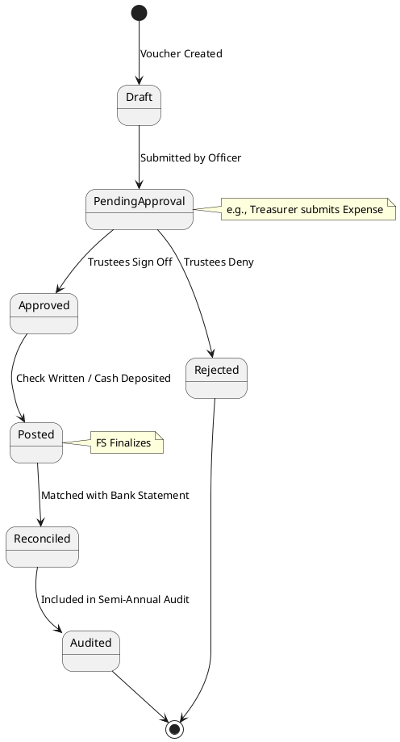

# State Diagrams

This document models the lifecycle of key entities in the **Officers Online** system.

## 1. Member Status Lifecycle

Tracks a member's journey from potential candidate to active member and potential exit paths.

## 2. Dues Record Status Lifecycle

Tracks the status of a specific billing record for a Fraternal Year.

## 3. Transaction Lifecycle (Ledger)

Lifecycle of a financial transaction (Income or Expense) within the council ledger.

