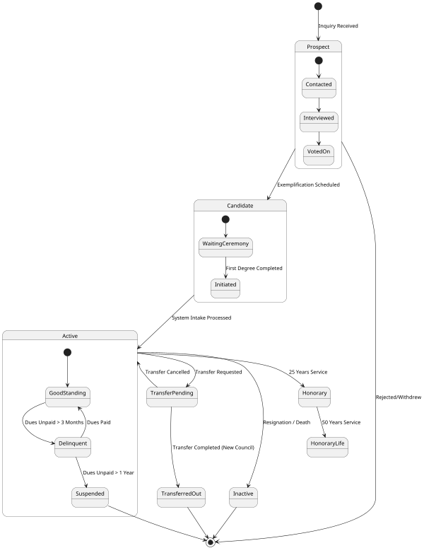
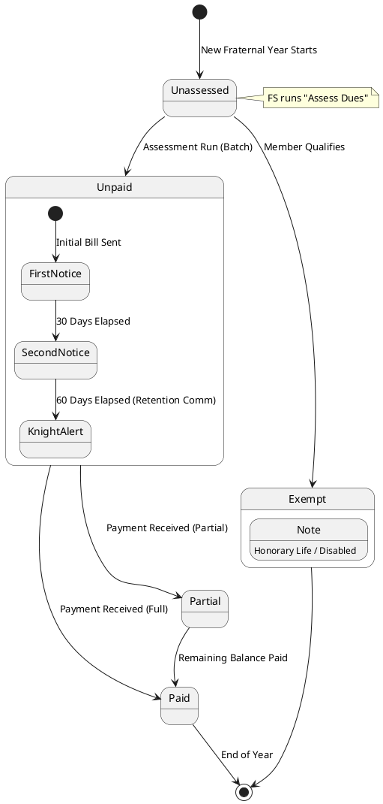
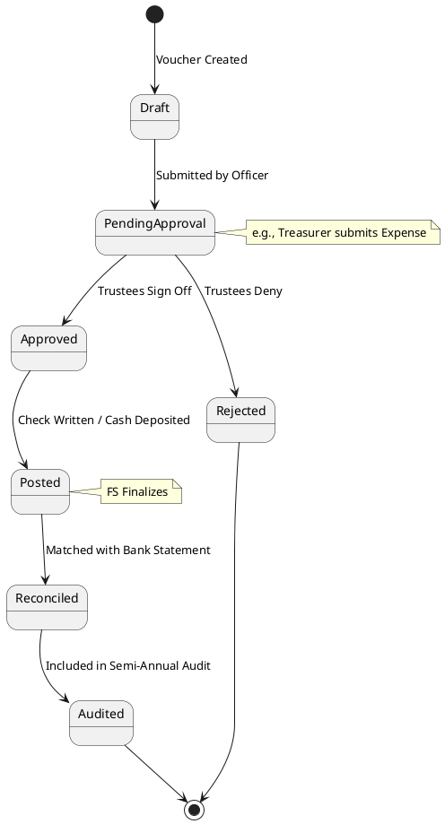
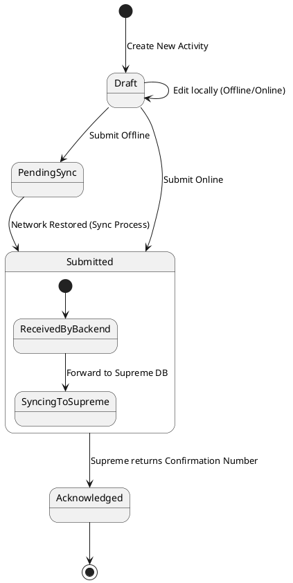
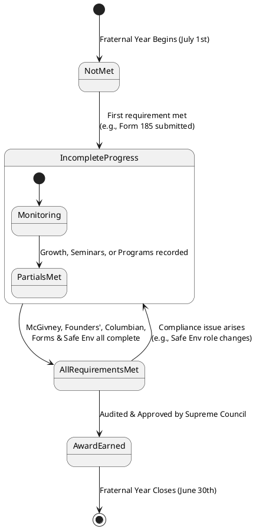

# State Diagrams

This document models the lifecycle of key entities in the **Officers Online** system.

## 1. Member Status Lifecycle

Tracks a member's journey from potential candidate to active member and potential exit paths.

```plantuml
@startuml
scale 600 width

[*] --> Prospect : Inquiry Received

state Prospect {
  [*] --> Contacted
  Contacted --> Interviewed
  Interviewed --> VotedOn
}

Prospect --> Candidate : Exemplification Scheduled
Prospect --> [*] : Rejected/Withdrew

state Candidate {
  [*] --> WaitingCeremony
  WaitingCeremony --> Initiated : First Degree Completed
}

Candidate --> Active : System Intake Processed

state Active {
  [*] --> GoodStanding
  GoodStanding --> Delinquent : Dues Unpaid > 3 Months
  Delinquent --> GoodStanding : Dues Paid
  Delinquent --> Suspended : Dues Unpaid > 1 Year
}

Active --> TransferPending : Transfer Requested
TransferPending --> TransferredOut : Transfer Completed (New Council)
TransferPending --> Active : Transfer Cancelled

Active --> Inactive : Resignation / Death
Active --> Honorary : 25 Years Service
Honorary --> HonoraryLife : 50 Years Service

TransferredOut --> [*]
Inactive --> [*]
Suspended --> [*]

@enduml
```

## 2. Dues Record Status Lifecycle

Tracks the status of a specific billing record for a Fraternal Year.

```plantuml
@startuml

[*] --> Unassessed : New Fraternal Year Starts

Unassessed --> Unpaid : Assessment Run (Batch)
note right of Unassessed : FS runs "Assess Dues"

state Unpaid {
  [*] --> FirstNotice : Initial Bill Sent
  FirstNotice --> SecondNotice : 30 Days Elapsed
  SecondNotice --> KnightAlert : 60 Days Elapsed (Retention Comm)
}

Unpaid --> Paid : Payment Received (Full)
Unpaid --> Partial : Payment Received (Partial)

Partial --> Paid : Remaining Balance Paid

Paid --> [*] : End of Year

state Exempt {
  Note: Honorary Life / Disabled
}

Unassessed --> Exempt : Member Qualifies
Exempt --> [*]

@enduml
```

## 3. Transaction Lifecycle (Ledger)

Lifecycle of a financial transaction (Income or Expense) within the council ledger.

```plantuml
@startuml

[*] --> Draft : Voucher Created

Draft --> PendingApproval : Submitted by Officer
note right: e.g., Treasurer submits Expense

PendingApproval --> Approved : Trustees Sign Off
PendingApproval --> Rejected : Trustees Deny

Approved --> Posted : Check Written / Cash Deposited
note right: FS Finalizes

Posted --> Reconciled : Matched with Bank Statement
Reconciled --> Audited : Included in Semi-Annual Audit

Rejected --> [*]
Audited --> [*]

@enduml
```

## 4. Program Activity Status Lifecycle (Form 10784)

Tracks the workflow of a service program submission from creation to Supreme confirmation.

```plantuml
@startuml

[*] --> Draft : Create New Activity

Draft --> Draft : Edit locally (Offline/Online)
Draft --> PendingSync : Submit Offline
Draft --> Submitted : Submit Online

PendingSync --> Submitted : Network Restored (Sync Process)

state Submitted {
  [*] --> ReceivedByBackend
  ReceivedByBackend --> SyncingToSupreme : Forward to Supreme DB
}

Submitted --> Acknowledged : Supreme returns Confirmation Number
Acknowledged --> [*]

@enduml
```

## 5. Star Council Progress Status Lifecycle

Tracks the council's progress toward achieving the Star Council Award during a Fraternal Year.

```plantuml
@startuml

[*] --> NotMet : Fraternal Year Begins (July 1st)

NotMet --> IncompleteProgress : First requirement met\n(e.g., Form 185 submitted)

state IncompleteProgress {
  [*] --> Monitoring
  Monitoring --> PartialsMet : Growth, Seminars, or Programs recorded
}

IncompleteProgress --> AllRequirementsMet : McGivney, Founders', Columbian,\nForms & Safe Env all complete
AllRequirementsMet --> IncompleteProgress : Compliance issue arises\n(e.g., Safe Env role changes)

AllRequirementsMet --> AwardEarned : Audited & Approved by Supreme Council
AwardEarned --> [*] : Fraternal Year Closes (June 30th)

@enduml
```

