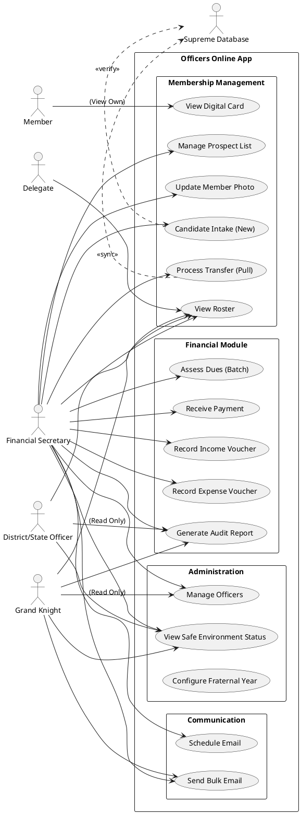

# Use Case Model

This document outlines the actors and use cases for the **Officers Online (Next Gen)** application.

## Actors

*   **Financial Secretary (FS):** Primary Administrator. Has full access to Membership and Financial modules.
*   **Grand Knight (GK):** Council Leader. Focuses on compliance, reports, and officer assignments.
*   **Delegate:** A standard member with granular permissions (e.g., Scribe, Treasurer).
*   **District/State Officer:** Read-only access to multiple councils.
*   **Member:** A general member of the council (limited access).
*   **System (Supreme DB):** The external Knights of Columbus central database.

## Use Case Diagram

## Use Case Descriptions

### Membership Management

*   **Candidate Intake (New):** FS enters details for a new Knight. System creates a new record if not found in Supreme.
*   **Process Transfer (Pull):** If a candidate exists in another council, the system initiates a transfer request.
*   **View Digital Card:** Displays the member's standing, degree, and dues status. Available to the Member (for themselves) and Officers (for verification).

### Financial Module

*   **Assess Dues:** Batch process to apply annual dues to billable members.
*   **Receive Payment:** Recording a member's dues payment (Cash/Check/Card) and generating a receipt.
*   **Council Ledger:** Recording general income and expenses for the council (e.g., Hall Rental, Pancake Breakfast).

### Administration & Communication

*   **Manage Officers:** Assigning roles for the current or next fraternal year.
*   **Safe Environment:** Dashboard to monitor officer compliance with background checks.
*   **Bulk Email:** Sending communications to filtered lists of members.
